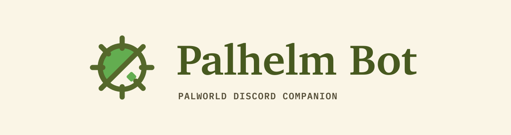

<p align="center"></p>

<p align="center">
  <a href="LICENSE"></a>
  = 20">
  
  <a href="https://docs.palhelm.com"></a>
  <!-- Enable once the repo is public:
  <a href="https://github.com/8tp/palhelm-bot/actions/workflows/ci.yml"></a>
  -->
</p>

A Discord companion bot for [Palhelm](https://github.com/8tp/palhelm), the self-hosted Palworld admin panel. It posts live server notifications (backups, shutdown countdowns, optional join/leave) into a channel, and answers slash commands with data from the panel, including rendered map and pal-icon images.

It requires a running Palhelm panel to talk to. Full docs: [docs.palhelm.com](https://docs.palhelm.com).

## Commands

| Command | Who | What |
|---|---|---|
| `/status` | everyone | Server name, state, version, uptime, players, day, FPS |
| `/players` | everyone | Who is online right now |
| `/player <name>` | everyone | Player profile plus their top pals (autocomplete) |
| `/pal <pal> [player]` | everyone | Inspect one owned pal instance: work suitability, stats, skills, placement |
| `/profile link\|status\|unlink` | everyone | Link Discord to an unclaimed Palworld player for personalized commands and AI |
| `/pals <name>` | everyone | A player's pals as an icon-grid image |
| `/box <name> [page]` | everyone | Browse a player's pal box with page buttons |
| `/map [layer]` | everyone | World map image with guild bases plotted |
| `/guilds` | everyone | Guilds, members, base counts |
| `/metrics` | everyone | FPS, frame time, players, day, uptime, base camps |
| `/history [filter]` | everyone | Recent joins, leaves, backups, and panel event summaries |
| `/leaderboard [category]` | everyone | Level, playtime, current pal, rare pal, and guild rankings |
| `/compare <a> <b>` | everyone | Side-by-side current player cards |
| `/trends [window]` | everyone | Level, playtime, and current-roster movement over time |
| `/whohas <pal>` | everyone | Find current owners of an observed pal species |
| `/records` | everyone | Current player, pal, and guild records |
| `/collection [player]` | everyone | Paldeck completion, missing species, and rare variants |
| `/dex <pal>` | everyone | 1.0 mechanics, learnset, work, ownership, icon, and sources |
| `/breed <child> [player]` | everyone | Parent pairs ranked by what is currently owned |
| `/breedpath <target> [player]` | everyone | Shortest breeding chain from the currently owned roster |
| `/workers <job> [player]` | everyone | Rank current workers for a base job |
| `/team <purpose> [player]` | everyone | Combat-party or base-role recommendations |
| `/rare [player]` | everyone | Current Boss, Alpha, and Lucky gallery |
| `/goal add\|list\|remove` | everyone | Restart-safe pal goals with completion notifications |
| `/progress [player]` | everyone | Lifetime captures, unique captures, and Paldeck unlocks |
| `/ask <question> [private]` | everyone | Optional read-only AI guide using server tools, pinned 1.0 knowledge, and cited web search |
| `/help` | everyone | Categorized directory of every bot command |
| `/diagnostics` | admin role | Cache, knowledge, history, AI, and automation status |
| `/profileadmin assign\|clear` | admin role | Reassign or clear Discord-to-Palworld player links |
| `/backup` | admin role | Trigger a world backup now |
| `/backups` | admin role | Recent backups plus the schedule |
| `/announce <msg>` | admin role | In-game broadcast |

"Admin role" is the Discord role in `ADMIN_ROLE_ID`. Scope it to trusted people; these commands act on the game server.

## How it talks to Palhelm

- **Reads** use the panel's read-only Integration API (`/api/integration/v1`) with a bearer key (the `phk_` prefix). That surface is redacted by design: nothing it returns is unsafe in a public channel (no platform IDs, live positions, ping, or ban state).
- **Everything the Integration API cannot do** (triggering backups, the event stream that powers notifications, in-game announcements, and the binary map tiles and pal icons) uses the panel's session API by logging in with the panel admin password, with automatic re-login on expiry.

Map tiles and pal icons must have been fetched on the panel host (the panel repo's `scripts/fetch-map-tiles.sh` and `scripts/fetch-pal-icons.sh`). When they are absent the bot degrades to text-only replies.

## Social tracking

One shared five-minute snapshot cache feeds leaderboards, comparisons, pal ownership lookup, bot presence, milestones, and the weekly digest, so commands do not independently poll the panel. The first successful snapshot is a silent baseline, and milestone claims are explicitly observations made since tracking began. Save-format drift on the panel side suppresses inferred milestones.

Observation state is written restart-safely under `BOT_DATA_DIR` (`data/` by default). Milestones are on by default; the weekly digest and health alerts are opt-in. Health alerts are notification-only and never restart anything.

`/ask` is optional and only active when `OPENROUTER_API_KEY` is configured. It can call deterministic read-only tools backed by the shared snapshot, a disk-cached version-pinned Palworld 1.0 dataset, and, when `SEARXNG_URL` is configured, a Palworld-scoped web search. It has no admin, backup, announcement, shell, or mutation tools, and it reports gaps instead of guessing. Attribution for the pinned knowledge sources is in [THIRD_PARTY-NOTICES.md](THIRD_PARTY-NOTICES.md).

## Setup

Prereq: Node 20 or newer, and a running Palhelm panel.

1. **Discord application.** At <https://discord.com/developers/applications>: create an app, then on the Bot tab use Reset Token and copy the token. No privileged intents are needed; leave Presence, Members, and Message Content off.
2. **Invite the bot** (scopes `bot` + `applications.commands`; permissions: Send Messages, Embed Links, Attach Files):

   ```text
   https://discord.com/oauth2/authorize?client_id=<APPLICATION_ID>&scope=bot%20applications.commands&permissions=51200
   ```

3. **Integration key.** In the panel as admin, open Settings, Integration API, and create a key labeled `discord-bot` (or `POST /api/v1/integration-keys`). The plaintext key is shown exactly once; copy it then.
4. **Configure.** `cp .env.example .env` and fill it in. Every variable is documented in the file. The main ones:

   | Key | What it is |
   |---|---|
   | `DISCORD_TOKEN` | bot token from the Developer Portal |
   | `DISCORD_APPLICATION_ID` | application ID from the Developer Portal |
   | `DISCORD_GUILD_ID` | your Discord server ID, e.g. `000000000000000000` |
   | `NOTIFY_CHANNEL_ID` | channel for backup and server notifications |
   | `ACTIVITY_CHANNEL_ID` | optional separate channel for the join/leave feed |
   | `ADMIN_ROLE_ID` | role allowed to run admin commands |
   | `PALHELM_BASE_URL` | panel URL, no trailing slash, e.g. `http://palhelm.lan:8080` |
   | `PALHELM_INTEGRATION_KEY` | the bearer key from step 3 |
   | `PALHELM_ADMIN_PASSWORD` | panel admin password, for the parts the read-only API does not cover |

   Treat the token, the key, and the password like passwords. Never commit `.env`. See [SECURITY.md](SECURITY.md).
5. **Install and register commands** (re-run `register` whenever commands change; guild-scoped registration shows up instantly):

   ```sh
   npm install
   npm run register
   ```

6. **Run**:

   ```sh
   npm start        # or: npm run dev (watch mode)
   ```

   Keep it alive with your supervisor of choice (systemd unit, docker, pm2).

## Development

```sh
npm run typecheck   # tsc --noEmit
npm test            # vitest run
```

`src/palhelm/` holds the two API clients, `src/snapshots/` the shared polling boundary, `src/history/` durable observations and scheduled social features, `src/commands/` one module per slash command, and `src/notify/` the event-stream-to-channel bridge. See [CONTRIBUTING.md](CONTRIBUTING.md).

## Related

- **Panel:** [github.com/8tp/palhelm](https://github.com/8tp/palhelm)
- **Docs:** [docs.palhelm.com](https://docs.palhelm.com)
- **Site:** [palhelm.com](https://palhelm.com)

## License

Apache-2.0. See [LICENSE](LICENSE) and [THIRD_PARTY-NOTICES.md](THIRD_PARTY-NOTICES.md). Palworld names and game concepts belong to Pocketpair. This is an unaffiliated fan project.
